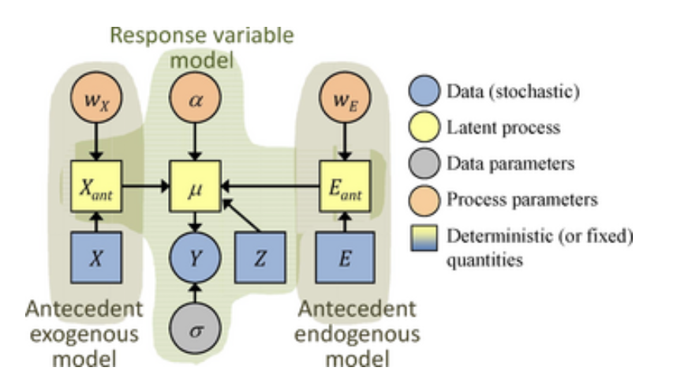

```{r setup, include=FALSE}
knitr::opts_chunk$set(echo = TRUE, message = FALSE, warnings = FALSE)
library(tidyverse)
library(lubridate)
library(rstan)
source('simulation_functions.R')
```


We have ecosystem metabolism data from 3 rivers and 7 different terrestrial ecosystems. Our goal here is to simulate different configurations of ecological memory to test the models we have available before running them on real datasets. In each simulation, you can choose:  
1) Which antecedent driver variable(s) are important 
2) What antecedent intervals the drivers act on
3) How important each time lag is in predicting the response variable

## Stochastic Antecedent Model  
Each of the example models below is based on Ogle et al 2015. They include a simple component built using concurrent drivers and a second component that incorporates antecedent conditions, determining both the magnitude and length of key time lags out of the set that it is given. 

{width=50%}

## River ecosystems

For three autotrophic rivers, we will simulate gross primary productivity (GPP) that has a memory of the past several days of discharge, representing disturbance from high flows. 

#### Rivers:  
1. Pecos River (nwis_08447000) - a large desert river impacted by salinization and invasive species.  
2. East Canyon Creek (nwis_10133800) - a high elevation desert stream.  
3. Clackamas River (nwis_14211010) - high productivity river in oregon, possibly macrophyte dominated.

#### Model:

\[GPP = (\beta_{l} \times light) \times (1 - \beta_Q \times Q_{ante})\]
\[Q_{ante} = \sum_{j=1}^N Q_{t-j} * w_j\]
\[0 \leq w \leq 1, \sum_j w_j = 1\]

\[GPP_{obs} \sim Normal(GPP, \sigma_{obs})\]

```{r}
dat <- read_csv('../data/powell_selected_sites.csv')
sites <- unique(dat$site_id)

# simulate memory of discharge in GPP timeseries
# model GPP as a linear function of light that decreases in the days following large floods
dd <- filter(dat, site_id == sites[1])
# parameters:
beta_light = 10
beta_Q_ante = 1
sigma_obs = 0.5  # observation error
nweights = 4     # the number of antecedent intervals we want to consider

light <- dd$Stream_PAR/max(dd$Stream_PAR, na.rm = T)
Q_norm <- dd$discharge/max(dd$discharge, na.rm = T)
# calculate antecedent discharge based on expected weights of 50% on t-1, 30% on t-2 and 20% on t-3
ante_Q_days <- calc_antecedent_drivers(driver = Q_norm, nweights = nweights)
weights <- c(0.5, 0.3, 0.2, 0)
ante_Q <- data.matrix(ante_Q_days)%*%weights
GPP_hat <- beta_light * light * (1 - beta_Q_ante * ante_Q)
dd$GPP_mod <- rnorm(nrow(dd), GPP_hat, sigma_obs)

plot(dd$date, dd$GPP_mod, col = 4, pch = 20, ylab = 'simulated GPP')
# lines(dd$date, GPP_hat, col = 4)
par(new = T)
plot(dd$date, dd$discharge, type = 'l', 
     xaxt = 'n', yaxt = 'n', xlab = '', ylab = '')

```

## Stan Code  
This is a simple model where GPP is a linear function of light that gets damped by the antecedent discharge term. Likely much better model formulations could be devised, but we can start with this one. The Stan code to fit this model follows the exact formulation that we used to simulate the data:  

```{r, comment='', echo = FALSE}
cat(read_lines('stan/river_ante_Q.stan'), sep = '\n')
```

Next, we fit our simulated data using this model:

```{r, eval = FALSE}
# vector of locations of missing observations:
missing_dat <- case_when(is.na(dd$GPP_mod) ~ 1,
                         TRUE ~ 0)
stan_dat <- fill_stan_dat(list(N = nrow(dd), nweights = nweights, 
                               GPP_obs = dd$GPP_mod, light = light, 
                               Q_ante = ante_Q_days, missing_dat = missing_dat))

mod <- stan('stan/river_ante_Q.stan', 
             data = stan_dat, 
             chains = 4,  cores = 4, 
             warmup = 500, iter = 1000)

saveRDS(mod, 'stan/fits/pecos_river_ante_Q.rds')
```

#### Examine model fit

```{r, echo = FALSE}
mod <- readRDS('stan/fits/pecos_river_ante_Q.rds')
print(mod, pars = c('beta_light', 'beta_Q', 'w', 'sigma_obs'))
# traceplot(mod, ncol = 2,  pars = c('beta_light', 'beta_Q', 'w', 'sigma_obs'))
plot_post_sim(mod, pars = c('beta_light', 'beta_Q', 'w', 'sigma_obs'), 
              vals = c( beta_light, beta_Q_ante, weights, sigma_obs),
              xlim = c(0,11))
```

The red triangles indicate the known parameter values with the distribution of model estimates shown in grey. This seems to be doing a decent job at recovering our parameters.


## Terrestrial Ecosystems  
To explore memory in terrestrial ecosystems, we have fluxnet data from 4 ecosystem types (see papers in the datasets folder of the [shared library](https://www.zotero.org/groups/4684864/eco_memory) for information on specific sites):  

#### 1) Grasslands  
CH-Cha: is a 'heavily managed' grassland in Switzerland  
US-SRG: a semi-desert grassland  
NL-Hor: A seemingly normal grassland

#### 2) Forests:  
US-HA1: Harvard Forest (temperate broadleaf)  
US-NR1: Niwot Ridge Forest (high elevation evergreen)

#### 3) Wetland:  
CZ-wet: sedgegrass marsh land

#### 4) Cropland:  
FR-Gri: crop rotation site

#### Model:

\[GPP = \beta_{l} \times light + \beta_P \times P_{ante}\]
\[P_{ante} = \sum_{j=1}^N precip_{t-j} * w_j\]
\[0 \leq w \leq 1, \sum_j w_j = 1\]

\[GPP_{obs} \sim Normal(GPP, \sigma_{obs})\]

```{r}
dat <- read_csv('../data/fluxnet_selected_sites.csv')
sites <- unique(dat$site_id)

# simulate memory of precipitation in GPP time series
# model GPP as a linear function of light that increases in the days following precipitation
dd <- filter(dat, site_id == sites[1])
# parameters:
beta_light = 1
beta_precip = 3
sigma_obs = 0.5  # observation error
nweights = 4     # the number of antecedent intervals we want to consider

light <- 10*dd$shortwave/max(dd$shortwave, na.rm = T)
precip_norm <- dd$precip_mm/max(dd$precip_mm, na.rm = T)

# calculate antecedent precip based on expected weights of 50% on t-1, 30% on t-2 and 20% on t-3
ante_P_days <- calc_antecedent_drivers(driver = precip_norm, nweights = nweights)
weights <- c(0.5, 0.3, 0.2, 0)
ante_P <- data.matrix(ante_P_days)%*%weights
GPP_hat <- beta_light * light + beta_precip * ante_P
dd$GPP_mod <- rnorm(nrow(dd), GPP_hat, sigma_obs)

plot(dd$date, dd$GPP_mod, col = 4, pch = 20, ylab = 'simulated GPP')
# lines(dd$date, GPP_hat, col = 4)
par(new = T)
plot(dd$date, dd$precip_mm, type = 'l', 
     xaxt = 'n', yaxt = 'n', xlab = '', ylab = '')

ggplot(dd, aes(shortwave, GPP_mod, col = precip_mm)) + geom_point()
```

## Stan Code  
In this model,GPP is a linear function of light and antecedent precip. The Stan code to fit this model follows the exact formulation that we used to simulate the data:

```{r, comment='', echo = FALSE}
cat(read_lines('stan/terr_ante_P.stan'), sep = '\n')
```

Next, we fit our simulated data using this model:

```{r, eval = FALSE}
# vector of locations of missing observations:
missing_dat <- case_when(is.na(dd$GPP_mod) ~ 1,
                         TRUE ~ 0)
stan_dat <- fill_stan_dat(list(N = nrow(dd), nweights = nweights, 
                               GPP_obs = dd$GPP_mod, light = light, 
                               P_ante = ante_P_days, missing_dat = missing_dat))

mod <- stan('stan/terr_ante_P.stan', 
             data = stan_dat, 
             chains = 4,  cores = 4, 
             warmup = 500, iter = 1000)

saveRDS(mod, 'stan/fits/Cha_terr_ante_P.rds')
```

#### Examine model fit

```{r, echo = FALSE}
mod <- readRDS('stan/fits/Cha_terr_ante_P.rds')
print(mod, pars = c('beta_light', 'beta_precip', 'w', 'sigma_obs'))
# traceplot(mod, ncol = 2,  pars = c('beta_light', 'beta_precip', 'w', 'sigma_obs'))
plot_post_sim(mod, pars = c('beta_light', 'beta_precip', 'w', 'sigma_obs'), 
              vals = c( beta_light, beta_precip, weights, sigma_obs),
              xlim = c(0,4))
```

This model is doing a poor job at recovering the parameter on antecedent precipitation. It is estimating that it is close to zero and therefore it is also unable to estimate the weights on different time lags because they do not impact the outcome. This suggests that this model is not a good structure. Precipitation is exponentially distributed, so it is only a very few days that are large enough to influence this parameter. Likely it would be more realistic to transform it or restructure the model so, that smaller amounts of precipitation can also stimulate productivity. 

